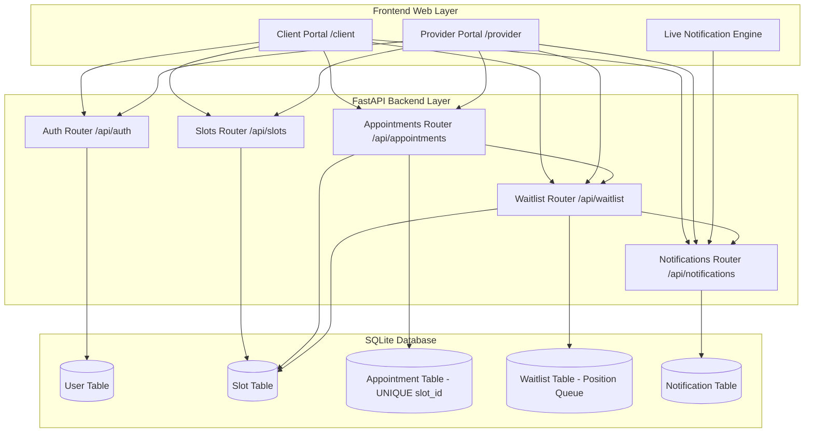

# 📅 AppointX - Appointment Management & Automated Waitlist System

A modern, high-concurrency **Appointment Management System** built with **FastAPI**, **SQLModel**, and a custom **Glassmorphism Vanilla JavaScript UI**. Features role-based access, atomic double-booking protection, real-time notification polling, and automated waitlist queue promotion.

---

## ✨ Features

### 👨‍⚕️ Provider (Doctor) Portal
* **Slot Management**: Create available service slots with date and time pickers.
* **Appointment Tracking**: View active bookings for your services and mark completed appointments.
* **Waitlist Queue Monitoring**: View clients waiting in queue for fully booked slots.
* **Slot Deletion**: Remove unbooked or cancelled slots safely.

### 👤 Client Portal
* **Service Browsing**: Browse open and booked appointment slots.
* **Atomic Race-Condition Booking**: Guarantees zero double-booking under simultaneous user requests.
* **Waitlist System**: Join the waitlist queue for booked slots.
* **Auto-Promotion**: If a booked appointment is cancelled by a client, position #1 on the waitlist is automatically promoted and booked!
* **Waitlist Management**: Leave waitlists at any time with automatic queue position reordering.

### 🔔 Live Notifications
* Polling notification engine alerting users when appointments are confirmed, cancelled, or auto-promoted from waitlists.

---

## 🛠️ Architecture & Tech Stack



* **Backend**: FastAPI (Python 3.13)
* **Database & ORM**: SQLModel / SQLAlchemy over SQLite (configured with `check_same_thread=False` for concurrency)
* **Authentication**: JWT Bearer tokens with OAuth2 password hashing (Passlib + Bcrypt)
* **Frontend**: HTML5, Vanilla CSS3 (Glassmorphism dark mode design system), Vanilla ES6 JavaScript
* **Testing**: Pytest with `ThreadPoolExecutor` concurrency test suite

---

## 🚀 Getting Started

### Prerequisites
* Python 3.10+
* [`uv`](https://github.com/astral-sh/uv) (recommended) or standard `pip`

### 1. Installation

Clone the repository and install dependencies:

```bash
git clone https://github.com/BadrinathanTV/Appointment-Management.git
cd Appointment-Management
uv sync
```

### 2. Running the Server

Start the development server with hot-reloading enabled:

```bash
uv run uvicorn app.main:app --port 8000 --reload
```

Open your browser at [http://127.0.0.1:8000](http://127.0.0.1:8000)

### 3. Dual-Portal Testing (Side-by-Side Client & Doctor View)

To test client booking and provider management simultaneously:

```bash
# Instance 1 (Default Port 8000)
uv run uvicorn app.main:app --port 8000 --reload

# Instance 2 (Second Window Port 8001)
uv run uvicorn app.main:app --port 8001 --reload
```

* **Client Portal**: Navigate to `http://127.0.0.1:8000/client`
* **Doctor Portal**: Navigate to `http://127.0.0.1:8001/provider`

---

## 📡 API Endpoints Reference

### 🔑 Authentication (`/api/auth`)
* `POST /api/auth/register` — Register a new user (`CLIENT` or `PROVIDER`).
* `POST /api/auth/login` — Login and receive JWT access token.
* `GET /api/auth/me` — Get current logged-in user profile.

### 📅 Slot Management (`/api/slots`)
* `POST /api/slots` — Create a new service slot (*Provider only*).
* `GET /api/slots/open` — List all open and booked browseable slots.
* `GET /api/slots/my` — List slots created by current provider (*Provider only*).
* `DELETE /api/slots/{id}` — Delete an unbooked slot.

### 📝 Appointments & Booking (`/api/appointments`)
* `POST /api/appointments/book/{slot_id}` — Book an open slot (Concurrency protected).
* `GET /api/appointments/my` — Fetch active non-cancelled appointments.
* `POST /api/appointments/{id}/cancel` — Cancel an appointment (Triggers waitlist auto-promotion).
* `POST /api/appointments/{id}/complete` — Mark an appointment as completed (*Provider only*).

### ⏳ Waitlist System (`/api/waitlist`)
* `POST /api/waitlist/join/{slot_id}` — Join the waitlist queue for a booked slot.
* `GET /api/waitlist/my` — View waitlist positions (*Clients*) or queued clients (*Providers*).
* `DELETE /api/waitlist/{waitlist_id}` — Leave a waitlist queue with position reordering.

### 🔔 Notifications (`/api/notifications`)
* `GET /api/notifications` — Retrieve unread user notifications.
* `POST /api/notifications/{id}/read` — Mark notification as read.

---

## 🧪 Running Automated Tests

Run the complete test suite (including concurrency race condition tests and bug verification):

```bash
PYTHONPATH=. uv run pytest tests/
```

### Test Coverage Includes:
* `test_flow.py`: Multi-threaded simultaneous booking race-condition verification (`201 Created` vs `409 Conflict`).
* `test_bugs_and_edge_cases.py`: Slot completion enum, waitlist promotion, cancelled slot filtering, waitlist deletion & reordering.

---

## 📄 License

MIT License. Built for high reliability and modern UX.
